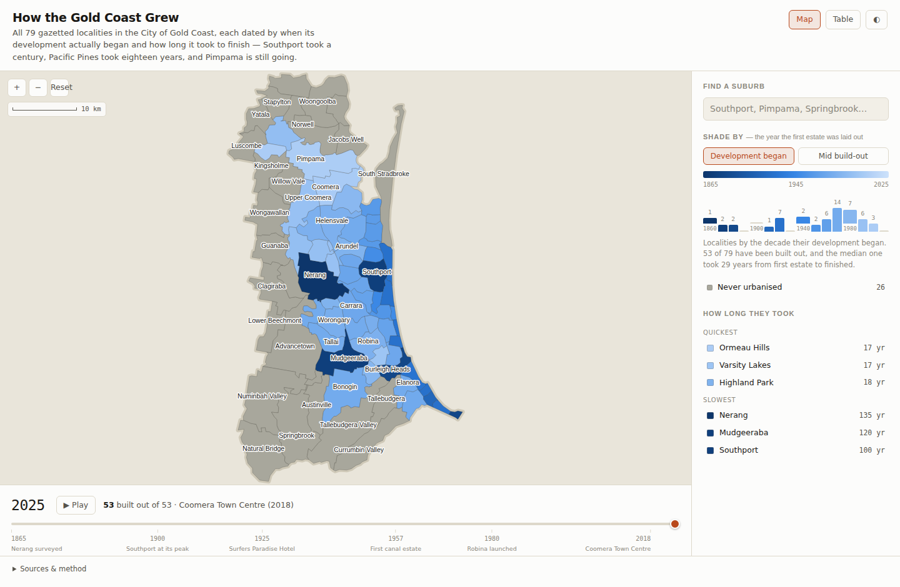

# How the Gold Coast Grew

An interactive map of all **79 gazetted localities in the City of Gold Coast**, each dated
by when its development actually began and how long it took to finish. Southport took a
century. Pacific Pines took eighteen years. Pimpama is still going.

Open `index.html` in a browser. No build step, no server, no dependencies.



## What each locality carries

Not an era bucket — four dates and a confidence rating:

| Field | Meaning |
|---|---|
| **First settled** | Earliest European settlement or survey |
| **Development began** | When the present urban fabric started being laid out — a township survey for the old towns, a first estate for the new ones |
| **Built out by** | When it was substantially complete (blank = still building) |
| **Took** | Years from first estate to finished |
| **Dating** | `high` / `medium` / `low` — how firm those years are |

The gap between the first two columns is the whole point. Pimpama had sugar mills in the
1870s and was still paddocks in 2005; its settlement date and its development date are 136
years apart.

## What the data says

**53 of the 79 localities have been built out. The other 26 never were** — they are
farmland, forest and national park, and they account for **55% of the city's land area**.
The Gold Coast is a thin urban ribbon on a large rural council.

Development starts run from **1865 to 2006**, median 1972. The 1970s were the peak decade,
with 14 localities starting. Build-outs run from **17 to 135 years**, median 29:

| Quickest | | Slowest | |
|---|---|---|---|
| Ormeau Hills | 17 yr | Nerang | 135 yr |
| Varsity Lakes | 17 yr | Mudgeeraba | 120 yr |
| Highland Park | 18 yr | Southport | 100 yr |

The slow ones are the old river towns that spent a century as villages before suburbia
reached them. The quick ones are master-planned estates dropped onto cleared land.

## Features

- **Timeline scrubber** — drag through 1865–2025. Each suburb **fills in gradually**
  across its own build-out window rather than snapping on: dashed grey means not started,
  a part-saturated fill with a dashed orange edge means under construction, solid means
  finished. Press **Play** to run the whole 160 years.
- **Shade by** — colour the map either by the year development *began* or by the
  *midpoint* of the build-out. The two readings differ a lot for the old towns.
- **Click any suburb** for a panel showing its window drawn against the full 1865–2025
  axis, with the settlement year marked separately when it long predates development.
- **Decade histogram** in the legend, clickable to isolate a decade.
- **Table view** — every date, sortable by any column, and the accessible equivalent of
  the map.
- Pan, wheel-zoom and pinch-zoom; light and dark themes.

## Layout

```
index.html                      the map — self-contained, loads only the data file
data/suburb-development.csv     the dated research; the editable source of truth
data/gold-coast-eras.geojson    generated: boundaries + dates
data/gold-coast-eras.js         generated: the same payload as window.GC_DATA
scripts/localities.txt          the 79 localities that make up the LGA
scripts/build_data.py           joins boundaries to dates and writes both outputs
scripts/read_rdata_sf.py        minimal RData reader, for the optional ABS boundaries
```

`index.html` loads `data/gold-coast-eras.js` with a plain `<script>` tag rather than
`fetch`, so the page works from a `file://` URL without a web server.

## Changing the data

The dates are meant to be argued with. Edit `data/suburb-development.csv` — one row per
locality with `founded`, `start`, `end`, `confidence` and a `note` — then rebuild:

```sh
python3 scripts/build_data.py --fetch      # clones the boundary source on first run
python3 scripts/build_data.py              # subsequent runs use the cached clone
```

The build refuses to produce output if a locality has no row, a row matches no locality, a
boundary is missing, development starts before settlement, a suburb finishes before it
starts, or a completion year appears without a start year. The map and the table can never
silently disagree with the CSV.

## Sources and method

**Boundaries** are Queensland gazetted localities, from the Queensland Government /
Geoscape administrative boundaries, via
[tonywr71/GeoJson-Data](https://github.com/tonywr71/GeoJson-Data). Coordinates are rounded
to five decimal places (about a metre), well inside the source's own generalisation.

`scripts/build_data.py --abs path/to/suburb2021.rda` will use ABS SAL 2021 boundaries from
the [absmapsdata](https://github.com/wfmackey/absmapsdata) R package instead. These are the
same resolution but clip to the coastline, so the Broadwater and the river mouths read as
water rather than being filled in. `scripts/read_rdata_sf.py` is a small RData reader
written for this, because `pyreadr` cannot open an `sf` object.

**Which localities are in the LGA** is the list in `scripts/localities.txt`. Queensland's
locality dataset carries no LGA field, and the two proxies that are easy to reach are both
wrong at the edges here: postcode 4207 pulls in Beenleigh and Eagleby from Logan City, and
ABS SA4 "Gold Coast" pulls in Tamborine Mountain and Beechmont from the Scenic Rim while
dropping Yatala, Stapylton, Alberton and Steiglitz. The list is therefore explicit, and
checked geometrically: the union of the 79 polygons is a single contiguous region with no
interior gaps, which is what the City of Gold Coast actually is. ABS independently confirms
the awkward case — it disambiguates the locality as "Gilberton (Gold Coast - Qld)".

**Dates are editorial.** They were compiled by hand from the published history of each
locality, and they are judgement calls, not an official dataset. Suburbs do not start and
stop on a single day, so `start` marks the first substantial subdivision and `end` marks
the point of substantial completion. Each row states how firm that is: 37 rows are `high`
(a survey, a subdivision or an opening date), 38 are `medium` (the decade is solid, the
years are estimates) and 4 are `low` (acreage released gradually, with no single date).
Where a place has two defensible answers — Broadbeach was subdivided in the 1920s but sat
almost empty until 1949 — the note records both and the dates follow the building.

**Colour.** Years map continuously onto a single-hue blue ramp, oldest furthest from the
page in both themes. The ramp's steps are checked for lightness monotonicity and adequate
separation; intermediate years interpolate between adjacent documented steps, so every
rendered colour stays on the ramp. "Never urbanised" sits off the scale in a neutral chosen
to clear the perceptual-separation floor against the palest blue. Because the palest steps
fall below 3:1 against the page, every shape carries a stroke and the table view carries
the same data as text.

## Licence

The code here is yours to do as you like with. The boundary data originates with the
Queensland Government and the ABS and carries its own licence terms — check the upstream
source before redistributing it.
